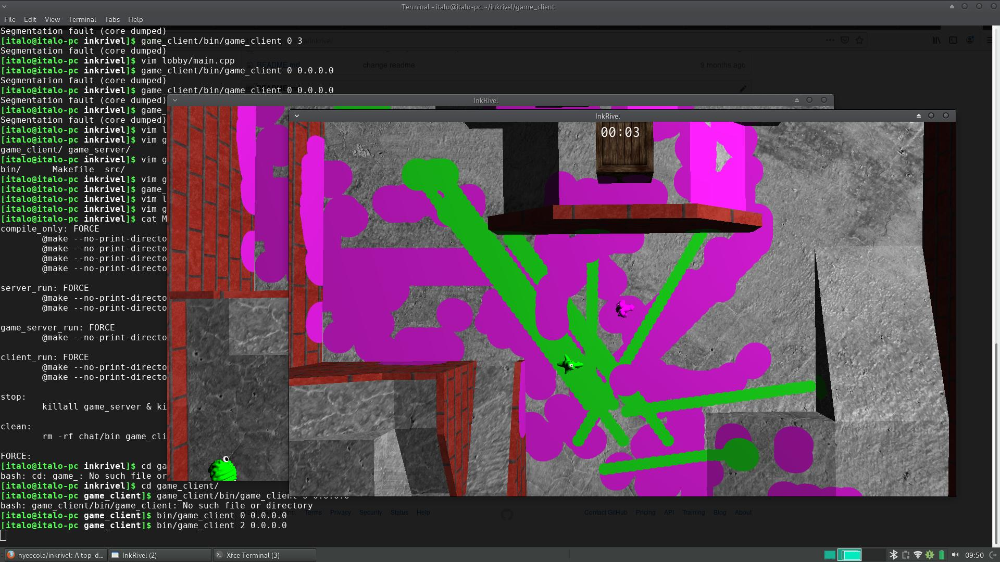
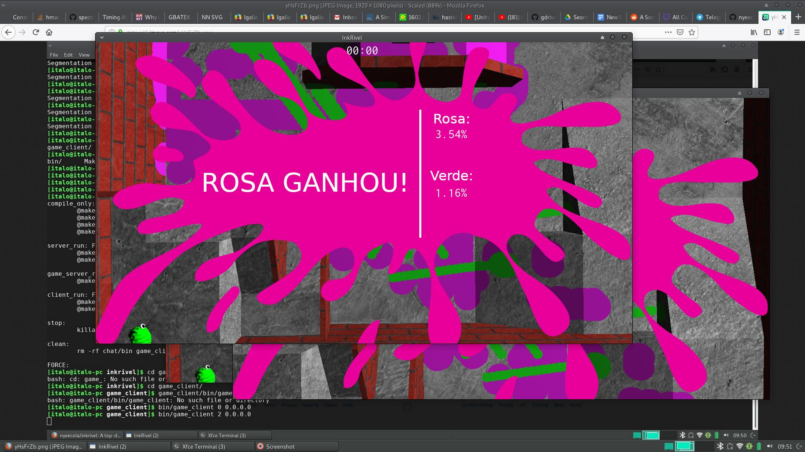

# External libraries needed

- SDL2 (https://www.libsdl.org/)
- SDL2_mixer
- SDL2_image
- stb_truetype (https://github.com/nothings/stb/blob/master/stb_truetype.h
- glfw

# How to run
- From the root of the project:
`make game_server_run` (Runs the game server)
`make server_run` (Runs the account and chat server)
`make client_run` (Runs the lobby which can be used to find a game and start playing) 

# Screenshots

